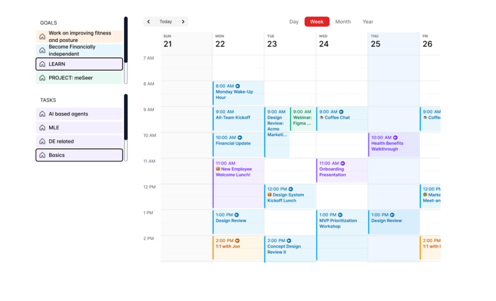

Enhancements to the below assignment
• I am sorry guys, lots of people were able to complete the below assignment. I need
to challenge you further to find the best talents
• Apart from the below, please make sure the calendar has the following attributes:
o If I put start time as 8.15 and ending as 8.30, an event of only 15 mins should
be visible
o An event can be expanded and contracted
o An event can be deleted
• On the left side of the calendar
o Two lists aare being fetched from the database
o If you click on on of the goals, the correponsing tasks get populated, which
will be the same color as the goal. Eg: If user clicks on Learn, 4 tasks(AI
based agents, MLE, DE related, Basics) get populated
o The user can drag and drop the task over to the calendar and the event gets
created with the same name as the task. Eg: If drag and drop the task “MLE”
on Thursday at 3pm, the modal opens with the event name MLE with the
time/date pre-populated

